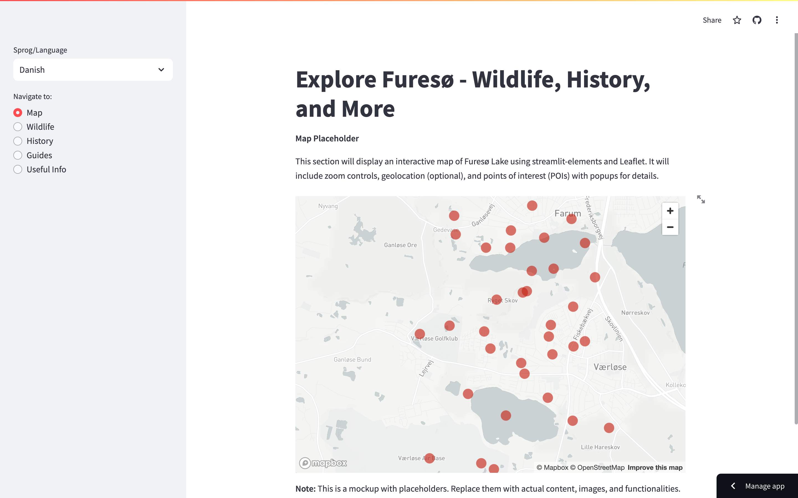

# Furesø Lake App - Explore Copenhagen 🇩🇰 (or Explore Furesø - Wildlife, History & More ️) 🇬🇧

[app](https://fureso.streamlit.app/)

This Streamlit app is your one-stop guide to Furesø Lake, a captivating natural wonder near Copenhagen.  Whether you're a local Dane seeking a deeper understanding of this cherished landmark ️ or an English-speaking visitor planning a trip , this app has something for everyone!

**Key Features:**

- **Interactive Map** (using `streamlit-elements` and Leaflet): ️ Explore Furesø Lake with an interactive map, complete with zoom controls and optional geolocation. Discover points of interest (POIs) like birdwatching spots, fishing areas, and historical landmarks, all enriched with informative popups.
- **Wildlife Galore** : Delve into the diverse wildlife that calls Furesø Lake home. Learn about fish species , a variety of birdlife (including majestic woodpeckers 啄木鸟!), and other mammals . We'll also touch upon poisonous algae (Planteædere alger) ⚠️ and its potential effects, along with resources for further exploration.
- **A Rich History** : Uncover the fascinating history of Furesø Lake, from its geological formation  to the impact of human settlements over time ‍‍‍. Explore its cultural significance through folklore and myths .
- **Essential Guides** : Get the most out of your visit with our comprehensive guides. Discover the best hiking and biking trails ‍♀️, tips for birdwatching and nature observation , fishing regulations and permits , and links to local visitor centers or guide services .
- **Useful Information** ℹ️: Be prepared for your Furesø Lake adventure with practical details like public transportation options , parking information 🅿️, accessibility details for wheelchair users ♿️, nearby amenities (restaurants, restrooms) ️, and emergency contact information .

**Getting Started:**

1. **Prerequisites:** Ensure you have Python  and `streamlit`  installed. You might also need `streamlit-elements` and a map library like Leaflet for the interactive map.
2. **Clone the Repository:** Use `git clone https://github.com/your-username/furesø-lake-app.git` to clone this repository.
3. **Install Dependencies:** Run `pip install -r requirements.txt` (assuming you have a `requirements.txt` file listing the necessary libraries).
4. **Run the App:** Execute `streamlit run app.py` (replace `app.py` with your actual app file name) to launch the Streamlit app in your web browser.

**Customization:**

This is a foundational framework. Feel free to customize it further by:

- Adding more details and visuals to each section.
- Integrating other functionalities like search bars or social media sharing buttons.
- Enhancing the user interface with custom styling or Streamlit components.

**Languages:**

The app currently supports both Danish (Dansk) and English (English). You can select your preferred language from the sidebar.

**Let's Explore Furesø Lake Together!**

We hope this app serves as a valuable resource for anyone interested in exploring Furesø Lake. Feel free to contribute to this project by creating pull requests or raising issues on the GitHub repository.

**Happy exploring!**
